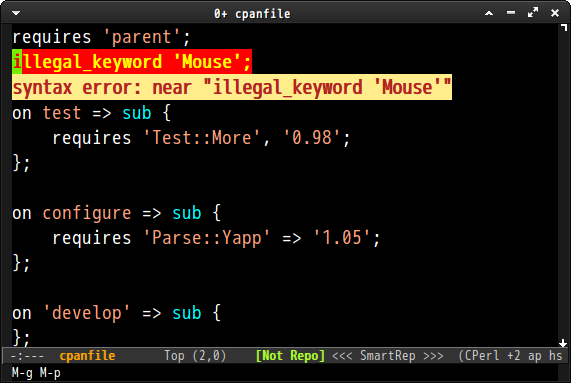

# flymake-cpanfile
flymake-cpanfile is flymake for cpanfile.
This package is inspired by [syntstic-cpanfile](https://github.com/moznion/syntastic-cpanfile).


## screenshot




## Sample Configuration

```
% git clone git://github.com/syohex/emacs-flymake-cpanfile.git ~/.emacs.d/flymake-cpanfile
```

```elisp
(add-to-list 'load-path "~/.emacs.d/flymake-cpanfile")
(require 'flymake-cpanfile)

(defun my/cpanfile-hook ()
  (let ((name (buffer-file-name)))
    (if (and name (string= "cpanfile" (file-name-nondirectory name)))
        (flymake-cpanfile-setup)
      (flymake-mode 1))))

(add-to-list 'auto-mode-alist '("cpanfile\\'" . cperl-mode))
(add-hook 'cperl-mode-hook 'my/cpanfile-hook)
```
